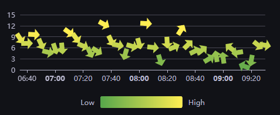

# signalk-dashboard

Server plugin &amp; dashboards for SignalK

## Purpose

Consider this plugin if you have at least one RaspberryPi connected to a screen installed in your boat environment and connected some NMEA data sources. It will allow for displaying current and historical measurements stored in a timeseries database as well as monitoring your boat IT infrastructure. If you already configured dashboarding using grafana you can simply leverage the plugin to automatically start you preferred dashboard during SignalK server launch - and in addition switch boards according to the change of navigation states.

## Install & Use

### Prerequisites

- RaspberryPi 3/4/5 64bit Bullseye or Bookworm OS with minimal desktop enabled or chromium browser installed  
*Note: Alternative browsers, likewise Firefox may be possible to be configure, but have not been tested*
- SignalK Server (v2.x) installed and configured
- InfluxDB (v1.8.x or v2.7.x) - for details see next section
*Note: For InfluxDB v3 (aka Influx Edge) has been recently made available as alpha-version for development and will be made available at at a later stage*
- Grafana (v11.5.x)
- Telegraf (v1.33.x or similar, if compatibel with the InfluxDB version used)
*Note: not required, but beneficial in case infra monitoring should be done*
- SignalK AutoState Plugin (> v0.4)
*Note: required, if dashboards shall follow vessel state changes*

Combining all services into a single device may work, but is not necessarily recommended for production to avoid performance issues when heavier data load is expected. A distributed implementation having SignalK separated from InfluxDB and Grafana may be better and is supported by the plugin; yet, requires some additional configuration steps for password-less remote exeuction - see also __[public key authentication](./pubkey.md)__

### SignalK Plugin configuration

Install the plugin from the SignalK app store and configure as outlined below:

- Grafana configuration is required to specify the default dashboard as well as additional alternative dashboards per navigation state
- Influx connection is required to provide base setup and device information for various dashboards
- Telegraf configuration is optional and may be done quite lite, eg. CPU load and temperature at a minimum

Post installation 'Activate' the plugin on the SignalK plugin config page.

### Browser Kiosk or Grafana Kiosk

The plugin supports 2 different modes of operation when displaying dashboards in a kiosk-alike experience:

- Chromium browser in full-screen with the grafana dashboard loaded in kiosk mode. In order to enable switching dashboards according to navigation states tabbed browsing is leveraged.
- Alternatively the same can be achieved by the __[grafana-kiosk utility](https://github.com/grafana/grafana-kiosk)__ configured as a system service.

*Note: While both modes should accomplish the same result, tabbed browsing may bare a certain risk of getting out of sync with the signalling of states from the server; in order to reduce the risk, some delays may be experienced during switching. On the other hand the Grafana Kiosk service needs to be restarted with each navigation state change and hence, will also cause some screen 'flickering'*

### Grafana configuration

In prinicple, no specific configuration needs to be done to the grafana service other than configuring an appropriate data source connecting to the InfluxDB in use and updating the dashboards accordingly.

*Note: For test purposes you might want to import __[rpi-monitoring](https://github.com/inspired-technologies/signalk-dashboard/tree/main/grafana/rpi-monitoring.json)__ into your grafana dashboard list - however, requires data from telegraf*

### InfluxDB configuration

In order for this plugin to work InfluxDB needs to be accessible and configured. Using the latest __[JS client](https://influxdata.github.io/influxdb-client-js/influxdb-client.html)__ v2 API, the plugin supports both OSS version 1.8.x (32bit) and 2.7.x (64bit).

Notes:

- Implementation likely is in the same local network as the SignalK server, but could be be hosted on docker or alternatively in the cloud
- Flux as query language is defaulted on v2.x, but has recently be moved into maintenance mode. Sample dashboards provided with this plugin still use Flux to enquiry.
- For Influx v1.8.x Flux can be __[enabled, but is disabled by default](https://docs.influxdata.com/influxdb/v1/flux/installation/)__

Enter your influx connection as

| Configuration | Influx v1.8.x | Influx OSS v2.x |
| ------------- | ------------- | --------------- |
| URI           | http(s)://url:port | http(s)://url:port |
| Token         | username:password | token       |
| Organisation  | empty         | required        |
| Bucket        | database/retentionpolicy | bucket          |

### Telegraf configuration

The telegraf service is not required to be configured, but can provide useful monitoring information to your dashboards; see __[here](./telegraf.md)__  for install and config.

### Chromium browser cli test

In order to verify that installation and configuration was successful run the following command in bash using a ssh shell login to your RPi:
```
chromium-browser "https://time.is/Berlin" "http://localhost:port/d/rpi-monitor/rpi-monitoring?kiosk&orgId=1&timezone=Europe%2FBerlin&refresh=5m" --kiosk --noerrdialogs --disable-infobars --no-first-run --ozone-platform=wayland --enable-features=OverlayScrollbar --start-maximized & 
```
*Note: Tests have been with Raspberry OS configured to wayland backend with labwc instead of X11 or Wayfire, but any other configuration might work fine as well.*
This should load the RPi Monitor Dashboard in full screen and Grafana in Kiosk mode like this:
[image]
Use the following command to switch between tabs:
```
wtype -M ctrl -P Tab
```
which brings the next tab showing time in Berlin, Germany.
[image]
In order stop the browser, identify the process id via
```
pgrep chromium | head -1
```
and kill the executed process with
```
kill <id returned from previous cmd>
```

### Grafana Kiosk cli test

Create or modify the `grafana-kiosk` yaml configuration to load your default dashboard:
```
general:
  kiosk-mode: full
  autofit: true
  lxde: false
  lxde-home: /home/pi
  scale-factor: 1
target:
  login-method: local
  username: pi
  password: **redacted**
  playlist: false
  URL: >-
    http://localhost:port/d/rpi-monitor/rpi-monitoring?kiosk&orgId=1&timezone=Europe%2FBerlin&refresh=5m
  ignore-certificate-errors: false
``` 
In order to verify that installation and configuration was successful run the kiosk from the cmd line:
```
/usr/bin/grafana-kiosk -c /home/pi/signalk-dashboard.yaml
```
Finally, configure grafana-kiosk as system service

## Dashboards

Generally speaking every dashboard hosted in the Grafana service can be used within the plugin's configuration to display certain data sets - regardless if coming from SignalK, RaspberryPi or other sources.

### Grafana Plugins

Next to the standard set of panels some non-standard grafana plugins may be of interest to visualize data points likewise windrose or certain graphs. These may leverage custom configurations scripts in particular for eg. wind being displayed as multi-dimensional data point consisting of speed and direction.

### VolkovLab eCharts

Displaying a graphical chart with wind speed & direction over time can be accomplished with `Business Charts` provided as part of the Grafana plugins library



Activate the `VolkovLab eCharts` via
```
sudo grafana-cli plugins install volkovlabs-echarts-panel
```

### Spectraphilic Windrose
Another option is a windrose panel developed by Spectraphilic; it is still under development but may fulfill the needs.


Enable dev mode within grafana by editing  `/etc/grafana/grafana.ini`:
```
...
app_mode = development
...
[plugins]
allow_loading_unsigned_plugins = spectraphilic-windrose-panel
...
```

Then clone the __[repo](https://github.com/spectraphilic/grafana-windrose)__ and enable it as an unsigned plugin:
```
sudo mkdir -p /var/lib/grafana/plugins/spectraphilic-windrose-panel
sudo cp -r [git-dir]/dist/* /var/lib/grafana/plugins/spectraphilic-windrose-panel
sudo chown -R grafana /var/lib/grafana/plugins/spectraphilic-windrose-panel
sudo chgrp -R grafana /var/lib/grafana/plugins/spectraphilic-windrose-panel
sudo chmod -R 750 /var/lib/grafana/plugins/spectraphilic-windrose-panel
sudo ls -al /var/lib/grafana/plugins
```
Finally reboot or restart the grafana-service.

During testing at times we observed the plugin displaying an error state which later on disappeared again. Hence, do not expect it to be simply working.

### Dashboard configuration

Some of the samples dashboards require information to filter data from InfluxDB. In order to have the SignalK Plugin launching and switching dashboards proper configuration for hostnames and urls must be done:

1. Hostnames

In case Grafana and SignalK services not running on the same host also remote execution needs to be configured, otherwise can remain empty:

| Host Config | Kiosk Config |
| ----------- | ------------ |
|  |  |

In addition add the path to the appropriate keyfile to the plugin configuration within :
```
...
"grafana": {
  ...
  "launch": {
    ...
     "keyFile": "/home/pi/.ssh/id_rsa"
    ...
  },
  ...
},
...
```

2. Chromium

Variety of parameters may change depending on version - the following represent a working example for `latest chromium` on `bookworm`  
```
--kiosk --noerrdialogs --disable-infobars --no-first-run --ozone-platform=wayland --enable-features=OverlayScrollbar --start-maximized
```

*Note: in case grafana-kiosk is selected no specific chromium configuration needs to be done here - just specify the full path to the kiosk-configuration yaml file as param*

3. Dashboards

Unique IDs for dashbards and their parameters can be determined from the grafana UI and shall be configured accordingly in the plugin:


*Note: It is advisable not to configure variables as parameters as they are usually calculated from Influx during regular refreshes*


## Upload path configration

Despite - as mentioned above - dashboards can get data from various sources this `signalk-dashboard` plugin also allows for loading data into InfluxDB and building out certain measurements with associated tags. The plugin does this similarily to telegraf and in the same way as other plugins likewise `signalk-barograph` - configure SignalK data pathes to be captured in the `pathconfig.json` file stored in the plugin configuration data directory `<signalk-dir>/plugin-config-data/signalk-dashboard`

The sample dashboards leverage the following data points 

Position - if not covered elsewhere:
```
  { "path": "navigation.state", "policy": "instant", "config":"navigation.state|>navigation.vessel.position.state", "minPeriod": 10000 },
  { "path": "navigation.position", "policy": "instant", "config":"navigation.position|>navigation.vessel.position", "convert": "{lon,lat}|>latLng", "minPeriod": 10000 },
  { "path": "navigation.log", "policy": "fixed", "period": 60000, "config":"navigation.log|>navigation.throughwater.log" },
  { "path": "navigation.trip.log", "policy": "fixed", "period": 60000 }
```

Batteries & Tanks:
```
  { "path": "electrical.batteries.*.voltage", "period": 10000, "policy": "instant", "config": "label.~:electrical.batteries|>batteries", "minPeriod": 10000 },
  { "path": "tanks.freshWater.*.currentLevel", "period": 10000, "policy": "instant", "config": "type.fresh.label.~:freshWater.currentLevel|>level", "minPeriod": 10000 },
  { "path": "tanks.fuel.*.currentLevel", "period": 10000, "policy": "instant", "config": "type.fuel.label.~:fuel.currentLevel|>level", "minPeriod": 10000 }
```

Environmentals (if not covered by signalk-barograph):
```
  { "path": "environment.sunlight.times.sunrise", "period":3600000,"policy":"fixed","convert":"dt|>influx","config":"sunlight.times|>forecast.time"},
  { "path": "environment.sunlight.times.sunset", "period":3600000,"policy":"fixed","convert":"dt|>influx","config":"sunlight.times|>forecast.time"},
  { "path": "environment.*.temperature", "policy": "instant", "minPeriod": 10000 },
  { "path": "environment.*.pressure", "policy": "instant", "minPeriod": 10000 },
  { "path": "environment.*.humidity", "policy": "instant", "minPeriod": 10000 },
  { "path": "environment.*.relativeHumidity", "policy": "instant", "config": "relativeHumidity|>humidity", "minPeriod": 10000 },
```

## Samples

### Dashboard Moored


### Dashboard Sailing


### Dashboard Sailing


## Release Notes
- v0.2 Alpha Test
- v0.3 Beta Test
- v0.4 Brightness changing aligned to sunrise & sunset 

## Notes & References

This plugin is inspired by projects like full-screen __[kiosk-displays](https://grafana.com/blog/2019/05/02/grafana-tutorial-how-to-create-kiosks-to-display-dashboards-on-a-tv/)__ and __[rpi-kiosk](https://www.raspberrypi.com/tutorials/how-to-use-a-raspberry-pi-in-kiosk-mode/)__ yet more geared towards data gathered from SignalK and optimized for a smaller screen estate in a boating environment.

It has been tested and works well with certain touch displays available from WaveShare, eg. __[8.8inch-dsi-lcd](https://www.waveshare.com/8.8inch-dsi-lcd.htm)__ for RaspberryPi 4 and 5.

Grafana-Kiosk binaries for various hardware can be downloaded via the __[grafana-kiosk repo](https://github.com/grafana/grafana-kiosk)__ on GitHub.

SignalK __[AutoState](https://www.npmjs.com/package/@meri-imperiumi/signalk-autostate)__ Plugin can be directly installed from the App Store.